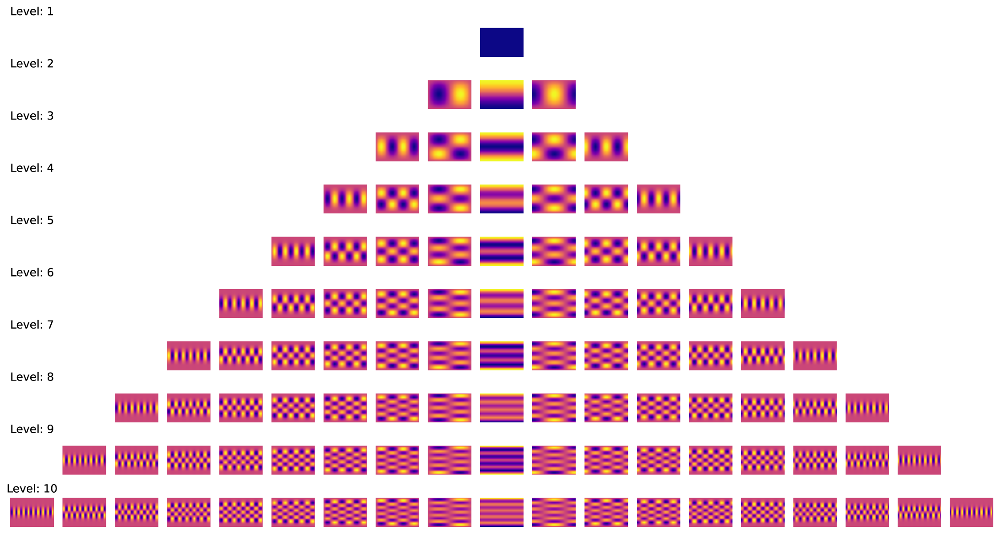

# Spherical Harmonics Table Generator

This is a simple Python script to generate a conversion table from cartesian (x, y, z) to spherical harmonics space. Thanks to [sympy](https://www.sympy.org/en/index.html), it automatically generates the higher level spherical harmonics.

Run `generate_sh_table.py` to generate the table. 

```
l=0, m=0  -> 1/(2*sqrt(pi))

l=1, m=-1 -> 0.5*sqrt(3)*y/(sqrt(pi)*r)
l=1, m=0  -> sqrt(3)*z/(2*sqrt(pi)*r)
l=1, m=1  -> sqrt(3)*x/(2*sqrt(pi)*r)

l=2, m=-2 -> 0.5*sqrt(15)*x*y/(sqrt(pi)*r**2)
l=2, m=-1 -> 0.5*sqrt(15)*y*z/(sqrt(pi)*r**2)
l=2, m=0  -> sqrt(5)*(2*r**2 - 3*x**2 - 3*y**2)/(4*sqrt(pi)*r**2)
l=2, m=1  -> sqrt(15)*x*z/(2*sqrt(pi)*r**2)
l=2, m=2  -> sqrt(15)*(x - y)*(x + y)/(4*sqrt(pi)*r**2)

l=3, m=-3 -> 0.0625*sqrt(70)*y*(6.0*x**2 - 2.0*y**2)/(sqrt(pi)*r**3)
l=3, m=-2 -> 0.5*sqrt(105)*x*y*z/(sqrt(pi)*r**3)
l=3, m=-1 -> 1.0*sqrt(42)*y*(0.5*r**2 - 0.625*x**2 - 0.625*y**2)/(sqrt(pi)*r**3)
l=3, m=0  -> sqrt(7)*z*(2*r**2 - 5*x**2 - 5*y**2)/(4*sqrt(pi)*r**3)
l=3, m=1  -> sqrt(42)*x*(4*r**2 - 5*x**2 - 5*y**2)/(8*sqrt(pi)*r**3)
l=3, m=2  -> sqrt(105)*z*(x - y)*(x + y)/(4*sqrt(pi)*r**3)
l=3, m=3  -> sqrt(70)*x*(x**2 - 3*y**2)/(8*sqrt(pi)*r**3)

l=4, m=-4 -> 0.75*sqrt(35)*x*y*(x**2 - y**2)/(sqrt(pi)*r**4)
l=4, m=-3 -> 0.0625*sqrt(70)*y*z*(18.0*x**2 - 6.0*y**2)/(sqrt(pi)*r**4)
l=4, m=-2 -> 0.0625*sqrt(5)*x*y*(72.0*r**2 - 84.0*x**2 - 84.0*y**2)/(sqrt(pi)*r**4)
l=4, m=-1 -> 1.0*sqrt(10)*y*z*(1.5*r**2 - 2.625*x**2 - 2.625*y**2)/(sqrt(pi)*r**4)
l=4, m=0  -> 3*(8*r**4 - 40*r**2*x**2 - 40*r**2*y**2 + 35*x**4 + 70*x**2*y**2 + 35*y**4)/(16*sqrt(pi)*r**4)
l=4, m=1  -> 3*sqrt(10)*x*z*(4*r**2 - 7*x**2 - 7*y**2)/(8*sqrt(pi)*r**4)
l=4, m=2  -> -3*sqrt(5)*(x - y)*(x + y)*(-6*r**2 + 7*x**2 + 7*y**2)/(8*sqrt(pi)*r**4)
l=4, m=3  -> 3*sqrt(70)*x*z*(x**2 - 3*y**2)/(8*sqrt(pi)*r**4)
l=4, m=4  -> 3*sqrt(35)*(x**4 - 6*x**2*y**2 + y**4)/(16*sqrt(pi)*r**4)

l=5, m=-5 -> 0.015625*sqrt(154)*y*(30.0*x**4 - 60.0*x**2*y**2 + 6.0*y**4)/(sqrt(pi)*r**5)
l=5, m=-4 -> 0.75*sqrt(385)*x*y*z*(x**2 - y**2)/(sqrt(pi)*r**5)
l=5, m=-3 -> 0.015625*sqrt(770)*y*(-6.0*r**2*x**2 + 2.0*r**2*y**2 + 54.0*x**2*z**2 - 18.0*y**2*z**2)/(sqrt(pi)*r**5)
l=5, m=-2 -> 0.0625*sqrt(1155)*x*y*z*(8.0*r**2 - 12.0*x**2 - 12.0*y**2)/(sqrt(pi)*r**5)
l=5, m=-1 -> 0.0625*sqrt(165)*y*(8*r**4 - 28*r**2*x**2 - 28*r**2*y**2 + 21*x**4 + 42*x**2*y**2 + 21*y**4)/(sqrt(pi)*r**5)
l=5, m=0  -> sqrt(11)*z*(8*r**4 - 56*r**2*x**2 - 56*r**2*y**2 + 63*x**4 + 126*x**2*y**2 + 63*y**4)/(16*sqrt(pi)*r**5)
l=5, m=1  -> sqrt(165)*x*(8*r**4 - 28*r**2*x**2 - 28*r**2*y**2 + 21*x**4 + 42*x**2*y**2 + 21*y**4)/(16*sqrt(pi)*r**5)
l=5, m=2  -> -sqrt(1155)*z*(x - y)*(x + y)*(-2*r**2 + 3*x**2 + 3*y**2)/(8*sqrt(pi)*r**5)
l=5, m=3  -> -sqrt(770)*x*(r - 3*z)*(r + 3*z)*(x**2 - 3*y**2)/(32*sqrt(pi)*r**5)
l=5, m=4  -> 3*sqrt(385)*z*(x**4 - 6*x**2*y**2 + y**4)/(16*sqrt(pi)*r**5)
l=5, m=5  -> 3*sqrt(154)*x*(x**4 - 10*x**2*y**2 + 5*y**4)/(32*sqrt(pi)*r**5)
```

Note: `r = sqrt(x**2 + y**2 + z**2)`

You can compare the result with the [Wikipedia page](https://en.wikipedia.org/wiki/Table_of_spherical_harmonics#Real_spherical_harmonics). It may require some simplification to match the result, but they are identical.

You can see the complete result in the `docs/table.txt` or run the code yourself.

Run `sh_encoder_levels10.py` to encode a 3D direction to spherical harmonics space. The visualized result is shown below.

